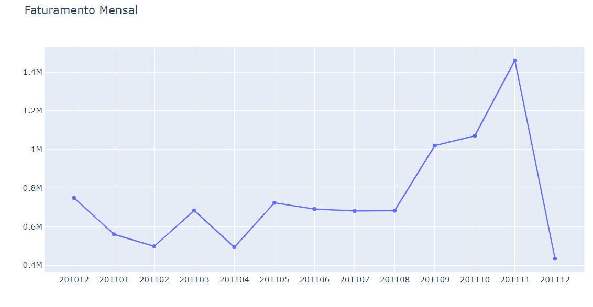

<h2>✅ Project Done!</h2>

<strong>Disclaimer:</strong> O projeto a seguir tem como base um projeto da Empresa <a href="https://www.kaggle.com/datasets/abhishekrp1517/online-retail-transactions-dataset">Kaggle</a>.

Para obter uma visão mais abrangente e detalhada da análise exploratória de dados, consulte o seguinte notebook Jupyter.

# Indicadores Chave de Performance (KPIs)

# 1.0 Objetivo

O objetivo desse Projeto em análise de Indicadores Chave de Performance(KPIs) é fornecer resultados analíticos que possa fornecer assistência para impulsionar o processo de marketing, além disso, permitir que os profissionais de Marketing avaliem o sucesso de suas iniciativas.  Isso,  impactará em tomadas de decisões corretas e a execução eficiente das campanhas e iniciativas de marketing de uma empresa.

# 2.0. Definindo o Problema
Trabalhamos como analistas em uma empresa que comercializa produtos importados dos mais variados tipos
para diversos países ao redor do mundo.

Nosso trabalho é calcular, analisar e interpretar 8 indicadores chave de performance com base nos
dados fornecidos. Os dados Os dados estão disponiveis disponiveis na plataforma da empresa kaggle: https://www.kaggle.com/.

Os indicadores foram definidos pela área de planejamento estratégico da empresa que precisa
acompanhar a evolução das vendas e a efetividade das campanhas de Marketing ao longo do tempo!

 <a href="#Objetivo">Objetivo</a> •
 <a href="#Definindo o Problema">Definindo o Problema</a> •
 <a href="#O Que são KPI ?">O Que são KPI?</a> •
 <a href="#Fonte de dados">Fonte de dados</a> • 
 <a href="#Como Definir os KPIs?">Como Definir os KPIs?</a> •
 <a href="#conclusions">Conclusions</a> •  
 <a href="#technologies">Technologies</a>  

# 3.0. O Que são KPI ?

KPI ou indicadores-Chave de Performance, são ferramenta de gestão empregada para analisar os indicadores mais importantes de um négocio ou empresa. Saber examente o que sua empresa precisa vai evitar desperdício de tempo e investimentos. cada empresa deve definir sues próprios indicadores.

# 4.0.  Fonte de dados

**Conjunto de dados de transações de varejo on-line**: https://www.kaggle.com/datasets/abhishekrp1517/online-retail-transactions-dataset

## 4.1 Conjunto de Dados 
| Columns              | Description |
| ---------------------| --------- |
| StockCode            | Código utilizado para identificar o produto que foi adquirido      |  
| Description          | Uma breve descrição do produto que foi adquirido    |  
| Quantity             | A quantidade do produto que foi comprado   |  
| InvoiceDate          | A data e hora em que a compra foi feita     |  
| UnitPrice	           | O preço de uma unidade do produto que foi comprado  |
| CustomerID           | O identificador exclusivo do cliente que fez a compra       |  
| Country              | País onde se encontra o cliente que efetuou a compra    |

# 5.0. Como Definir os KPIs?

Cada empresa deve definir seus próprios indicadores com base no que gostária de medir ou analisar ao longo do tempo. O link a seguir oferece uma biblioteca de KPIs com exemplos nos mais variados setores: http://kpilibrary.com

Os 8 indicadores que farão parte da nossa análise são:

1. Indicador 1 - Faturamento Mensal

2. Indicador 2 - Taxa Percentual de Crescimento Mensal

3. Indicador 3 - Clientes Ativos Por Mês em um País 

4. Indicador 4 - Total de Itens Comprados Por Mês em um País 

5. Indicador 5 - Faturamento Médio Mensal em um País 

6. Indicador 6 - Diferença de Faturamento ao Longo do Tempo Entre Clientes Novos e Antigos

7. Indicador 7 - Taxa de Novos Clientes

8. Indicador 8 - Taxa Mensal de Retenção de Clientes

## 5.1. Indicador 1 - Faturamento Mensal

Definição do Faturamento Mensal:

Faturamento = Quantidade * valor_Unitario

No scatter plot cada ponto representa a junção do Ano + Mês + Faturamento.

No início do período o  Faturamento apresenta um comportamento sazonal, depois passar a apresentar um comportamento estacionário entre os meses de maio a julho. E seguido de um crescimento acentuado nos meses de agosto até novembro. Então, para o ano de 2012 o Indicador de performance apresenta um comportamento médio até que há um pico de vendas em novembro.

### 5.2 Indicador 2 - Taxa Percentual de Crescimento Mensal

Definição Taxa Percentual de Crescimento Mensal:

Taxa Percentual de Crescimento Mensal = Faturamento Mensal / Faturamento Mensal Anterior * 100

 

O scatter plot da Taxa Percentual de Crescimento Mensal apresenta sazonalidade. É necessário  investigar esse comportamento periódico de queda na Taxa Percentual de Crescimento Mensal.

## 5.3. Indicador 3 - Clientes Ativos Por Mês em um País(United Kingdom)

Definição:
Clientes ativos são aqueles que fizeram pelo menos uma compra em cada mês.

 

Observa-se um padrão entre dezembro de 2010 e outubro de 2011. Ocorrendo um pico em novembro de 2011, sendo condizente com os indicadores anteriores.

### 5.4. Indicador 4 - Total de Itens Comprados Por Mês em um País 

Observe que o padrão é mantido no indicador 4, tendo um volume menor de vendas no início do ano e um volume maior de venda ao final do ano.

A partir desse indicador também é possível fazer um melhor planejamento logístico de entrega do produto para o ano seguinte. Por exemplo: Investir em marketing para o início do ano. Como forma de aumentar as vendas e manter um padrão homogêneo para todo ano.

## 5.5. Indicador 5 - Faturamento Médio Mensal em um País 

  

Analisando os gráficos, observa-se que o mês de dezembro de 2011 apresentar o maior faturamento total, mas é o mês de setembro que tem o maior faturamento médio. Considerando que houve mais promoções para o período de novembro que setembro, podemos dizer que esse efeito é conhecido como marketing share, isto é, a empresa consegue ter mais presença no mercado consumidor, trazendo novos clientes. Mas, como foram vendidos mais produtos a um preço menor, consequentemente isso impactou no custo.

## 5.6. Indicador 6 - Diferença de Faturamento ao Longo do Tempo Entre Clientes Novos e Antigos

Vamos considerar cliente novo aquele com baixo volume de compras e cliente antigo aqule com alto volume de compras.

  

O cliente antigo gerar faturamento muito maior para a empresa que o cliente novo. Isso faz sentido, sabendo-se que o novo cliente primeiro tem que construir o seu histórico de comprar.

## 5.7. Indicador 7 - Taxa de Novos Clientes

Como definimos clientes novos e antigos no indicador 6, agora podemos usar os dados e calcular a proporção de novos clientes ao longo do tempo.

  

Veja que nos meses de fevereiro, março e abril houver um número maior de novos clientes.

## 5.8. Indicador 8 - Taxa Mensal de Retenção de Clientes

Taxa Mensal de Retenção de Clientes = Clientes do Mês Anterior / Total de Clientes Ativos

  

A retenção é mantida de um mês para o outro, houver uma queda considerada em setembro, seguido de um novo aumento.

# 6.0. Considerações finais

Este é um projeto útil para qual quer empresa que tenha dados de faturamento. Podendo ser aplicado o mesmo raciocínio e calcular os indicadores chaves de performance.

# 7.0. Technologies

As seguintes ferramentas, bibliotecas e IDE foram usadas na construção do projeto:

- [Python](https://www.python.org/)
- [Jupyter Notebook](https://jupyter.org/)
- [Pandas](https://pandas.pydata.org/)
- [Numpy](https://numpy.org/)
- [Maptplot Lib](https://matplotlib.org/)
- [plotly](https://plotly.com/)
- [Requests API](https://requests.readthedocs.io/en/latest/)
- [Visual Studio Code](https://code.visualstudio.com/)

# 8.0. Author

[@andriellymoraespereira](https://www.linkedin.com/in/andriellymoraespereira/)
